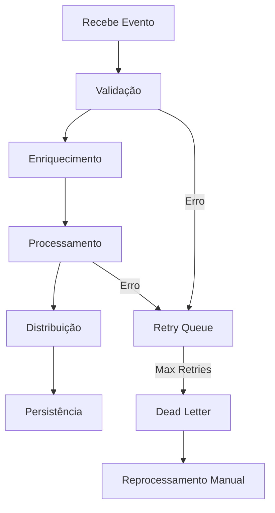

# Event Orchestrator Microservice

Microserviço orquestrador de eventos B2B desenvolvido com NestJS, projetado para receber, validar, processar e distribuir eventos de parceiros com alta performance e confiabilidade.

## 🚀 Características Principais

- **Alta Performance**: Suporte a 100+ eventos por segundo
- **Event-Driven Architecture**: Processamento assíncrono com filas
- **Type Safety**: TypeScript end-to-end com validação runtime
- **Observabilidade**: Logs estruturados e métricas integradas
- **Retry & Dead Letter**: Mecanismo robusto de reprocessamento
- **Rate Limiting**: Proteção contra abuso da API
- **Idempotência**: Garantia de processamento único
- **Docker Ready**: Containerização completa

## 🛠️ Stack Tecnológica

### Core
- **NestJS** + **TypeScript** - Framework enterprise-ready
- **PostgreSQL** + **Prisma** - Banco de dados com type-safety
- **Redis** + **BullMQ** - Message broker e sistema de filas

### Observabilidade & Qualidade
- **Winston** - Logs estruturados
- **Prometheus** - Métricas e monitoring
- **Swagger/OpenAPI** - Documentação automática da API
- **Jest** - Testes automatizados

### Segurança
- **JWT** + **API Keys** - Autenticação
- **Zod** - Validação type-safe
- **Rate Limiting** - Proteção contra abuse

> 📋 Para detalhes completos da stack e justificativas técnicas, consulte [tech_stack_doc.md](./tech_stack_doc.md)

## 🏗️ Arquitetura

```
┌─ REST API (Controllers)
├─ Business Logic (Services)  
├─ Event Processing (Queues)
├─ Data Persistence (Repositories)
└─ External Integration (Simulated)
```

**Padrões Utilizados:**
- Clean Architecture
- Event-Driven Architecture  
- Repository Pattern
- Strategy Pattern

## 🐳 Execução com Docker (Recomendado)

### Pré-requisitos
- Docker 20+
- Docker Compose 2+

### Execução Rápida

```bash
# Clone o repositório
git clone <repository-url>
cd event-orchestrator

# Execute tudo com um único comando
docker-compose up -d

# Aguarde alguns segundos e acesse:
# API: http://localhost:3000
# Swagger: http://localhost:3000/api
# Prisma Studio: http://localhost:5555
```

### Logs e Monitoramento

```bash
# Visualizar logs em tempo real
docker-compose logs -f app

# Verificar status dos serviços
docker-compose ps

# Acessar métricas
curl http://localhost:3000/metrics
```

### Comandos Úteis

```bash
# Parar todos os serviços
docker-compose down

# Rebuild da aplicação
docker-compose up --build app

# Executar migrações do banco
docker-compose exec app npm run db:migrate

# Acessar shell do container
docker-compose exec app sh
```

## 🔧 Desenvolvimento Local

### Pré-requisitos
- Node.js 18+
- PostgreSQL 14+
- Redis 6+

### Instalação

```bash
# Instalar dependências
npm install

# Configurar variáveis de ambiente
cp .env.example .env
# Editar .env com suas configurações

# Executar migrações
npm run db:migrate

# Gerar cliente Prisma
npm run db:generate

# Iniciar em modo desenvolvimento
npm run start:dev
```

## 📡 API Endpoints

### Eventos

```http
POST   /events              # Criar novo evento
GET    /events/:id          # Consultar evento específico
GET    /events/:id/status   # Status de processamento
POST   /events/:id/retry    # Reprocessar evento
GET    /events/stats        # Estatísticas gerais
```

### Monitoramento

```http
GET    /health              # Health check
GET    /metrics             # Métricas Prometheus
```

### Documentação Interativa
- **Swagger UI**: `http://localhost:3000/api`

## 🧪 Testes

```bash
# Testes unitários
npm run test

# Testes com coverage
npm run test:cov

# Testes de integração
npm run test:e2e

# Executar todos os testes
npm run test:all
```

## 📊 Tipos de Eventos Suportados

| Tipo | Descrição | Campos Obrigatórios |
|------|-----------|-------------------|
| `VENDA` | Registro de venda | `produto_id`, `quantidade`, `valor` |
| `DEVOLUÇÃO` | Devolução de produto | `venda_id`, `motivo` |
| `ATUALIZAÇÃO_ESTOQUE` | Atualização de estoque | `produto_id`, `quantidade` |

## 🔄 Fluxo de Processamento



## 🔐 Autenticação

### API Key (Recomendado)
```bash
curl -H "X-API-Key: your-api-key" \
     -H "Content-Type: application/json" \
     -d '{"tipo":"VENDA","dados":{...}}' \
     http://localhost:3000/events
```

### JWT Token
```bash
# 1. Obter token
curl -X POST http://localhost:3000/auth/login \
     -d '{"username":"partner","password":"secret"}'

# 2. Usar token
curl -H "Authorization: Bearer <token>" \
     http://localhost:3000/events
```

## 📈 Monitoramento e Observabilidade

### Métricas Principais
- `events_received_total` - Total de eventos recebidos
- `events_processed_total` - Total de eventos processados
- `events_failed_total` - Total de eventos com falha
- `processing_duration_seconds` - Tempo de processamento

### Logs Estruturados
```json
{
  "timestamp": "2025-06-04T10:30:00.000Z",
  "level": "info",
  "message": "Event processed successfully",
  "eventId": "evt_123",
  "eventType": "VENDA",
  "partnerId": "partner_001",
  "processingTime": 150
}
```

## 🚦 Rate Limiting

- **Global**: 1000 req/min por IP
- **Por Parceiro**: 100 req/min por API key
- **Burst**: Até 10 req/segundo momentâneo

## 🔄 Sistema de Retry

- **Tentativas**: 3 retries automáticos
- **Backoff**: Exponencial (1s, 4s, 16s)
- **Dead Letter**: Após esgotar tentativas
- **Reprocessamento**: Manual via API

## 🐛 Troubleshooting

### Problemas Comuns

**Erro de Conexão com Banco:**
```bash
# Verificar se PostgreSQL está rodando
docker-compose ps postgres

# Ver logs do banco
docker-compose logs postgres
```

**Redis não responde:**
```bash
# Verificar Redis
docker-compose exec redis redis-cli ping

# Resetar Redis
docker-compose restart redis
```

**Aplicação não inicia:**
```bash
# Verificar logs da aplicação
docker-compose logs app

# Rebuild completo
docker-compose down && docker-compose up --build
```

## 📚 Recursos Adicionais

- Especificações da stack: [tech_stack_doc.md](tech_stack_doc.md)